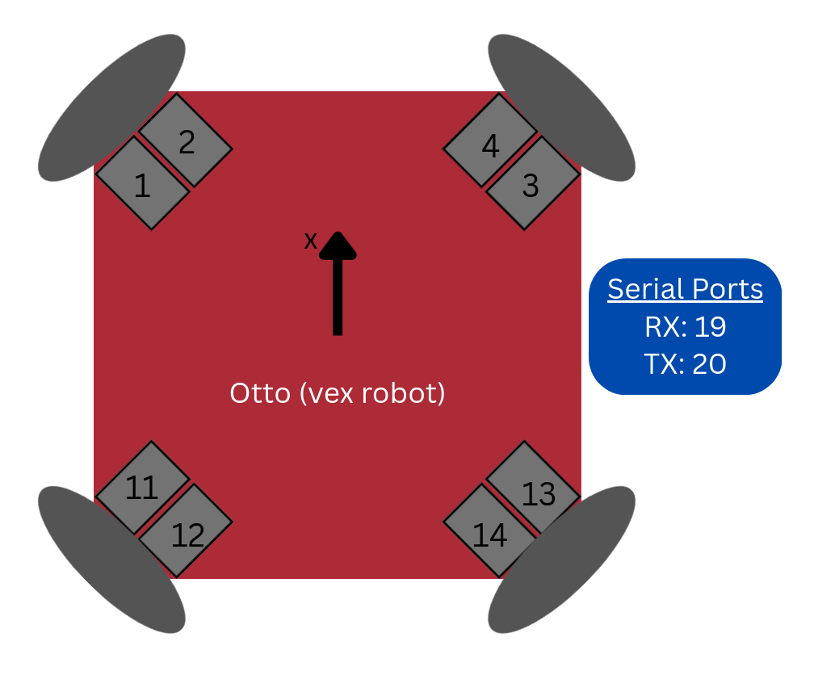

# v5_bridge
A VEX Brain program that recieves velocity and transmits position and velocity information. Works together with [`Autonomous-VEXU/otto_hardware`](https://github.com/Autonomous-VEXU/otto_hardware.git) and [`Autonomous-VEXU/otto_bringup`](https://github.com/Autonomous-VEXU/otto_bringup.git).

### VEX brain port configuration
Otto's current configuration with the ports labeled on the relative motor.
> Intake motors coming soon!



### Compiling and uploading to a VEX V5 robot

Use the cargo-v5 terminal utility to build and upload this vexide project.

```console
cargo v5 build
```

Use a USB cable to connect to your robot brain or to your controller before using the `upload` subcommand to build and upload the project. Make sure to specify a program slot.

```console
cargo v5 upload
```

### Viewing program output

You can view panic messages and calls to `println!()` using the terminal.
Use a USB cable to connect to your robot brain or controller, then start the terminal:

```console
cargo v5 terminal
```
